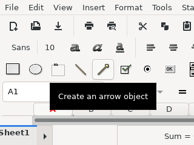
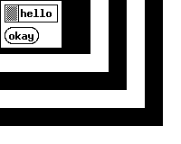

pyvirtualdisplay is a python wrapper for [Xvfb][1], [Xephyr][2] and [Xvnc][3]

Links:
 * home: https://github.com/ponty/pyvirtualdisplay
 * PYPI: https://pypi.python.org/pypi/pyvirtualdisplay

[](https://travis-ci.org/ponty/pyvirtualdisplay)

Features:
 - python wrapper
 - supported python versions: 3.6, 3.7, 3.8, 3.9
 - back-ends:  [Xvfb][1], [Xephyr][2] and [Xvnc][3]

Possible applications:
 * headless run
 * GUI testing
 * automatic GUI screenshot

Installation
============

install the program:

```console
$ python3 -m pip install pyvirtualdisplay
```

optional: [Pillow][pillow] should be installed for ``smartdisplay`` submodule:

```console
$ python3 -m pip install pillow
```

If you get this error message on Linux then your Pillow version is old.
```
ImportError: ImageGrab is macOS and Windows only
```

on Ubuntu 20.04:

```console
$ sudo apt-get install xvfb xserver-xephyr tigervnc-standalone-server xfonts-base
$ python3 -m pip install pyvirtualdisplay pillow
```

Usage
=====

Controlling the display with `start()` and `stop()` methods:

```py
from pyvirtualdisplay import Display
disp = Display().start()
# display is active
disp.stop()
# display is stopped
```

After Xvfb display is activated "DISPLAY" environment variable is set for Xvfb.
(e.g. `os.environ["DISPLAY"] = :1`)
After Xvfb display is stopped "DISPLAY" environment variable is restored to its original value.


Controlling the display with context manager:

```py
from pyvirtualdisplay import Display
with Display() as disp:
    # display is active
    pass
# display is stopped
```

Selecting Xvfb backend:

```py
disp=Display()
# or
disp=Display(visible=False)
# or
disp=Display(backend="xvfb")
```

Selecting Xephyr backend:
```py
disp=Display(visible=True)
# or
disp=Display(backend="xephyr")
```

Selecting Xvnc backend:
```py
disp=Display(backend="xvnc")
```

Setting display size:

```py
disp=Display(size=(100, 60))
```

Setting display color depth:

```py
disp=Display(color_depth=24)
```

Headless run
------------

The display is hidden.

```py
# pyvirtualdisplay/examples/headless.py

"Start Xvfb server. Open xmessage window."

from easyprocess import EasyProcess

from pyvirtualdisplay import Display

with Display(visible=False, size=(100, 60)) as disp:
    with EasyProcess(["xmessage", "hello"]) as proc:
        proc.wait()

```

If `visible=True` then a nested Xephyr window opens and the GUI can be controlled.

vncserver
---------

The same as headless example, but it can be controlled with a VNC client.

```py
# pyvirtualdisplay/examples/vncserver.py

"Start virtual VNC server. Connect with: vncviewer localhost:5904"

from easyprocess import EasyProcess

from pyvirtualdisplay import Display

with Display(backend="xvnc", size=(100, 60), rfbport=5904) as disp:
    with EasyProcess(["xmessage", "hello"]) as proc:
        proc.wait()

```

Run it:
```console
$ python3 -m pyvirtualdisplay.examples.vncserver
```

<!-- embedme doc/gen/vncviewer_localhost:5904.txt -->
Check it with vncviewer:
```console
$ vncviewer localhost:5904
```


GUI Test
--------

```py
# pyvirtualdisplay/examples/lowres.py

"Testing gnumeric on low resolution."
from easyprocess import EasyProcess

from pyvirtualdisplay import Display

# start Xephyr
with Display(visible=True, size=(320, 240)) as disp:
    # start Gnumeric
    with EasyProcess(["gnumeric"]) as proc:
        proc.wait()

```

<!-- embedme doc/gen/python3_-m_pyvirtualdisplay.examples.lowres.txt -->
Run it:
```console
$ python3 -m pyvirtualdisplay.examples.lowres
```

Image:




Screenshot
----------

```py
# pyvirtualdisplay/examples/screenshot.py

"Create screenshot of xmessage in background using 'smartdisplay' submodule"
from easyprocess import EasyProcess

from pyvirtualdisplay.smartdisplay import SmartDisplay

# 'SmartDisplay' instead of 'Display'
# It has 'waitgrab()' method.
# It has more dependencies than Display.
with SmartDisplay() as disp:
    with EasyProcess(["xmessage", "hello"]):
        # wait until something is displayed on the virtual display (polling method)
        # and then take a fullscreen screenshot
        # and then crop it. Background is black.
        img = disp.waitgrab()
img.save("xmessage.png")

```

<!-- embedme doc/gen/python3_-m_pyvirtualdisplay.examples.screenshot.txt -->
Run it:
```console
$ python3 -m pyvirtualdisplay.examples.screenshot
```

Image:


Nested Xephyr
-------------

```py
# pyvirtualdisplay/examples/nested.py

"Nested Xephyr servers"
from easyprocess import EasyProcess

from pyvirtualdisplay import Display

with Display(visible=True, size=(220, 180), bgcolor="black"):
    with Display(visible=True, size=(200, 160), bgcolor="white"):
        with Display(visible=True, size=(180, 140), bgcolor="black"):
            with Display(visible=True, size=(160, 120), bgcolor="white"):
                with Display(visible=True, size=(140, 100), bgcolor="black"):
                    with Display(visible=True, size=(120, 80), bgcolor="white"):
                        with Display(visible=True, size=(100, 60), bgcolor="black"):
                            with EasyProcess(["xmessage", "hello"]) as proc:
                                proc.wait()

```

<!-- embedme doc/gen/python3_-m_pyvirtualdisplay.examples.nested.txt -->
Run it:
```console
$ python3 -m pyvirtualdisplay.examples.nested
```

Image:



xauth
=====

Some programs require a functional Xauthority file. PyVirtualDisplay can
generate one and set the appropriate environment variables if you pass
``use_xauth=True`` to the ``Display`` constructor. Note however that this
feature needs ``xauth`` installed, otherwise a
``pyvirtualdisplay.xauth.NotFoundError`` is raised.

Concurrency
===========

If more X servers are started at the same time then there is race for free display numbers.

_"Recent X servers as of version 1.13 (Xvfb, too) support the -displayfd command line option: It will make the X server choose the display itself"_
https://stackoverflow.com/questions/2520704/find-a-free-x11-display-number/

Version 1.13 was released in 2012: https://www.x.org/releases/individual/xserver/

First help text is checked (e.g. `Xvfb -help`) to find if `-displayfd` flag is available.
If `-displayfd` flag is available then it is used to choose the display number.
If not then a free display number is generated and there are 10 retries by default 
which should be enough for starting 10 X servers at the same time.

`displayfd` usage is disabled on macOS because it doesn't work with XQuartz-2.7.11, always 0 is returned.

Thread safety
=============

All previous examples are not thread-safe, because `pyvirtualdisplay` replaces `$DISPLAY` environment variable in global [`os.environ`][environ] in `start()` and sets back to original value in `stop()`.
To make it thread-safe you have to manage the `$DISPLAY` variable.
Set `manage_global_env` to `False` in constructor.

```py
# pyvirtualdisplay/examples/threadsafe.py

"Start Xvfb server. Open xmessage window. Thread safe."

from easyprocess import EasyProcess

from pyvirtualdisplay import Display

# manage_global_env=False is thread safe
with Display(manage_global_env=False) as disp:
    # disp.new_display_var should be used for new processes
    print("disp.new_display_var=" + disp.new_display_var)

    # disp.env() copies global os.environ and adds disp.new_display_var
    print("disp.env()['DISPLAY']=" + disp.env()["DISPLAY"])

    # set $DISPLAY for subprocesses
    with EasyProcess(["xmessage", "-timeout", "1", "hello"], env=disp.env()) as proc:
        proc.wait()

```

<!-- embedme doc/gen/python3_-m_pyvirtualdisplay.examples.threadsafe.txt -->
Run it:
```console
$ python3 -m pyvirtualdisplay.examples.threadsafe
disp.new_display_var=:2
disp.env()['DISPLAY']=:2
```


Hierarchy
=========


[1]: http://en.wikipedia.org/wiki/Xvfb
[2]: http://en.wikipedia.org/wiki/Xephyr
[3]: https://tigervnc.org/
[pillow]: https://pillow.readthedocs.io
[environ]: https://docs.python.org/3/library/os.html#os.environ
