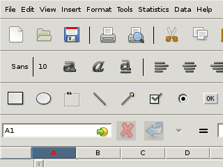

pyvirtualdisplay is a python wrapper for Xvfb_, Xephyr_ and Xvnc_

Links:
 * home: https://github.com/ponty/pyvirtualdisplay
 * documentation: http://pyvirtualdisplay.readthedocs.org
 * PYPI: https://pypi.python.org/pypi/pyvirtualdisplay

|Travis| |Coveralls| |Latest Version| |Supported Python versions| |License| |Code Health| |Documentation|

Features:
 - python wrapper
 - supported python versions: 2.7, 3.5, 3.6, 3.7, 3.8
 - back-ends: Xvfb_, Xephyr_, Xvnc_

Known problems:
 - only a few back-end options are supported

Possible applications:
 * GUI testing
 * automatic GUI screenshot

Basic usages
============

Start Xephyr::

    from pyvirtualdisplay import Display
    xephyr=Display(visible=1, size=(320, 240)).start()

Create screenshot of xmessage with Xvfb::

    from easyprocess import EasyProcess
    from pyvirtualdisplay.smartdisplay import SmartDisplay
    with SmartDisplay(visible=0, bgcolor='black') as disp:
        with EasyProcess('xmessage hello'):
            img = disp.waitgrab()
    img.show()

Installation
============

General
-------

 * install Xvfb_ or Xephyr_ or Xvnc_.
 * install pip_
 * optional: pyscreenshot_ and PIL_ should be installed for ``smartdisplay`` submodule
 * install the program::

    pip install pyvirtualdisplay

Ubuntu 14.04
------------
::

    sudo apt-get install python-pip
    sudo apt-get install xvfb xserver-xephyr vnc4server
    sudo pip install pyvirtualdisplay
    # optional
    sudo apt-get install python-pil scrot
    sudo pip install pyscreenshot
    # optional for examples
    sudo pip install entrypoint2

Uninstall
---------

::

    pip uninstall pyvirtualdisplay

Usage
=====

..  #-- from docs.screenshot import screenshot--#  
..  #-#

GUI Test
--------

Testing ``gnumeric`` on low resolution::

  #-- include('examples/lowres.py') --#
  from easyprocess import EasyProcess
  from pyvirtualdisplay import Display

  if __name__ == "__main__":
      # start Xephyr
      Display(visible=1, size=(320, 240)).start()
      # start Gnumeric
      EasyProcess('gnumeric').start()
  #-#

Image:

.. #-- screenshot('python -m pyvirtualdisplay.examples.lowres','lowres.png') --#

.. #-#

Screenshot
----------

Create screenshot of ``xmessage`` in background::

  #-- include('examples/screenshot3.py') --#
  '''
  using :keyword:`with` statement
  '''
  from easyprocess import EasyProcess
  from pyvirtualdisplay.smartdisplay import SmartDisplay

  if __name__ == "__main__":
      with SmartDisplay(visible=0, bgcolor='black') as disp:
          with EasyProcess('xmessage hello'):
              img = disp.waitgrab()

      img.show()
  #-#

Image:

..  #-- screenshot('python -m pyvirtualdisplay.examples.screenshot3','screenshot3.png') --#
.. image:: _img/screenshot3.png
..  #-#
    
vncserver
---------

::

  #-- include('examples/vncserver.py') --#
  '''
  Example for Xvnc backend
  '''

  from easyprocess import EasyProcess
  from pyvirtualdisplay.display import Display

  if __name__ == "__main__":
      with Display(backend='xvnc', rfbport=5904) as disp:
          with EasyProcess('xmessage hello') as proc:
              proc.wait()
  #-#

xauth
=====

Some programs require a functional Xauthority file. PyVirtualDisplay can
generate one and set the appropriate environment variables if you pass
``use_xauth=True`` to the ``Display`` constructor. Note however that this
feature needs ``xauth`` installed, otherwise a
``pyvirtualdisplay.xauth.NotFoundError`` is raised.

.. _pip: http://pip.openplans.org/
.. _Xvfb: http://en.wikipedia.org/wiki/Xvfb
.. _Xephyr: http://en.wikipedia.org/wiki/Xephyr
.. _pyscreenshot: https://github.com/ponty/pyscreenshot
.. _PIL: http://www.pythonware.com/library/pil/
.. _Xvnc: http://www.hep.phy.cam.ac.uk/vnc_docs/xvnc.html

.. |Travis| image:: http://img.shields.io/travis/ponty/PyVirtualDisplay.svg
   :target: https://travis-ci.org/ponty/PyVirtualDisplay/
.. |Coveralls| image:: http://img.shields.io/coveralls/ponty/PyVirtualDisplay/master.svg
   :target: https://coveralls.io/r/ponty/PyVirtualDisplay/
.. |Latest Version| image:: https://img.shields.io/pypi/v/PyVirtualDisplay.svg
   :target: https://pypi.python.org/pypi/PyVirtualDisplay/
.. |Supported Python versions| image:: https://img.shields.io/pypi/pyversions/PyVirtualDisplay.svg
   :target: https://pypi.python.org/pypi/PyVirtualDisplay/
.. |License| image:: https://img.shields.io/pypi/l/PyVirtualDisplay.svg
   :target: https://pypi.python.org/pypi/PyVirtualDisplay/
.. |Code Health| image:: https://landscape.io/github/ponty/PyVirtualDisplay/master/landscape.svg?style=flat
   :target: https://landscape.io/github/ponty/PyVirtualDisplay/master
.. |Documentation| image:: https://readthedocs.org/projects/pyvirtualdisplay/badge/?version=latest
   :target: http://pyvirtualdisplay.readthedocs.org
